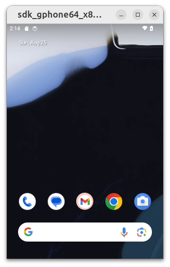

# docker-android


The project allows to run android emulator in docker container. This is convenient when used in CI/CD
# Requirements
- Docker must be installed.
- KVM must be available. You can get access to KVM by running on "bare metal", or on a (virtual) machine that provides nested virtualization.

*NOTE: The images will not run in docker on mac or windows* :slightly_smiling_face:
# Quick start
Build image:
```bash
docker build --build-arg SDK_VERSION=34 --build-arg EMULATOR_ARCH=x86_64 --build-arg EMULATOR_TYPE=google_apis -t sys-34-google_apis-x86_64:latest .
```

Run container:
```bash
docker run --rm --device /dev/kvm --publish 8554:8554/tcp --publish 5554:5554/tcp --publish 5555:5555/tcp --privileged sys-34-google_apis-x86_64:latest
```
Uses `--device /dev/kvm` to have CPU acceleration.

You also have the option setup addition [emulator run arguments](https://developer.android.com/studio/run/emulator-commandline) and mount a /data partition which the emulator will use if available. This enables you to use a tmpfs which can give increased performance, especially in the nested virtualization scenario.
```bash
docker run --rm --device /dev/kvm --mount type=tmpfs,destination=/data --publish 8554:8554/tcp --publish 5554:5554/tcp --publish 5555:5555/tcp --privileged -e "EMULATOR_PARAMS=-timezone Europe/Moscow" sys-34-google_apis-x86_64:latest
```
# Note
The project is based on [Avito-android](https://github.com/avito-tech/avito-android) with minor add-ons.
